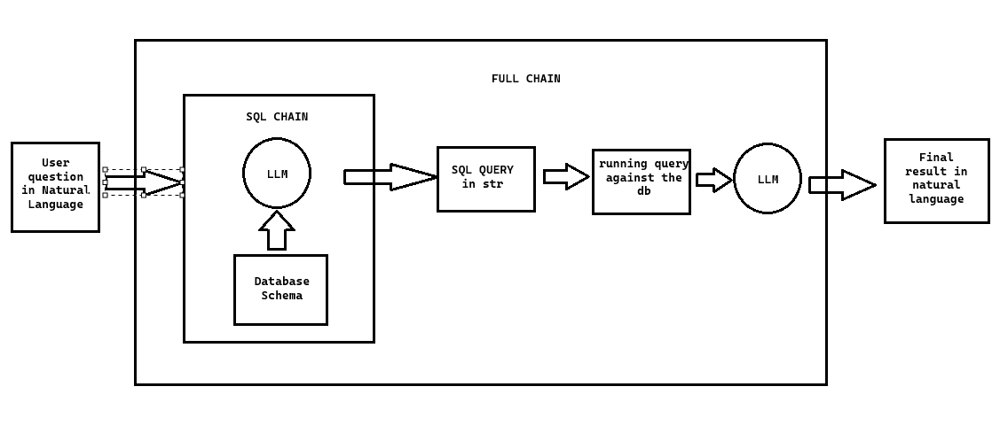

# Welcome to the Repository

Welcome to the repository for our comprehensive guide on building a natural language SQL chatbot leveraging GPT-4! This project will walk you through creating a chatbot capable of interpreting natural language inputs, translating them into SQL queries, and retrieving data from a SQL database, all within a seamless and intuitive user interface. The chatbot utilizes the power of OpenAI's GPT-4 model, integrated with a Streamlit-based GUI to enhance the user experience.

## Project Workflow

## Key Features

- **Natural Language Understanding**: Harnesses GPT-4 to comprehend and respond to user queries in plain language.
- **Dynamic SQL Query Generation**: Converts user inputs into SQL queries on-the-fly using GPT-4.
- **Database Interaction**: Connects to a SQL database, runs the generated queries, and retrieves results, demonstrating real-world database interactions.
- **Streamlit Interface**: Provides an easy-to-use graphical interface built with Streamlit, suitable for users at any skill level.
- **Python Implementation**: The entire project is implemented in Python, following best practices in modern software development.

## Overview of How the Chatbot Operates

The chatbot processes user input by first converting the natural language query into a SQL query using GPT-4. This query is then executed against a SQL database, and the results are returned to the user in natural language. The entire process involves multiple steps, including data processing, interaction with the OpenAI API, and seamless integration within a Streamlit application.
